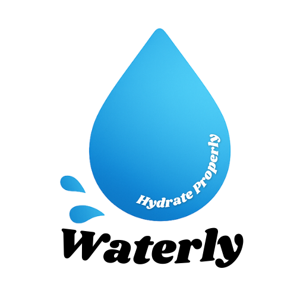

<p align="center">
  
</p>

<p align="center"><i>Hydrate Properly</i></p>

---

## 🌊 Overview

**Waterly** is a modern hydration tracking app built with Jetpack Compose. It helps you build healthy water-drinking habits through a clean interface, smooth animations, and insightful hydration stats. Whether you're improving your fitness routine or just staying mindful — Waterly keeps you on track, one sip at a time.

---

## 🔥 Why You'll Love Waterly

🚫 No clutter.  
✅ No over-complication.  
Just a beautifully crafted app that does one thing extremely well — helps you **hydrate properly**.

- ✨ **Zero onboarding friction** — open and start tracking instantly  
- 📈 **Progress that keeps you going** — weekly stats that feel rewarding  
- 🎨 **Modern UI with purpose** — clean, calming, and satisfying  
- 🔋 **Lightweight and efficient** — no bloat, no drain  

> 💧 Waterly is the habit key — **Hydrate Properly.**

---


## ✨ Features

Waterly is designed to change that — with:

-   
  A delightful splash screen powered by **Lottie** animations  

-   
  A simple and intuitive UI for quick logging  

-   
  Smart visual insights into your weekly hydration progress  

-   
  Persistent hydration history stored using **Jetpack DataStore**  

-   
  All wrapped in a smooth, **Jetpack Compose**-native experience

---

## 🛠️ Tech Stack

| Layer         | Tool / Library            |
|---------------|----------------------------|
| UI            | Jetpack Compose            |
| Navigation    | Navigation Compose         |
| Animation     | Lottie for Compose         |
| Storage       | Jetpack DataStore          |
| Language      | Kotlin                     |
| Architecture  | Composable-Driven (MVVM-ready) |

---

## 🚀 Getting Started

1. Clone the repo:
   ```bash
   git clone https://github.com/veronika8597/Waterly.git

---

## 👩‍💻 Author
Made with 💙 by Veronika


---

Let me know if you want:
- A version with real screenshots
- MVVM structure pre-generated
- A clickable demo badge (e.g. Play Store / video link)

